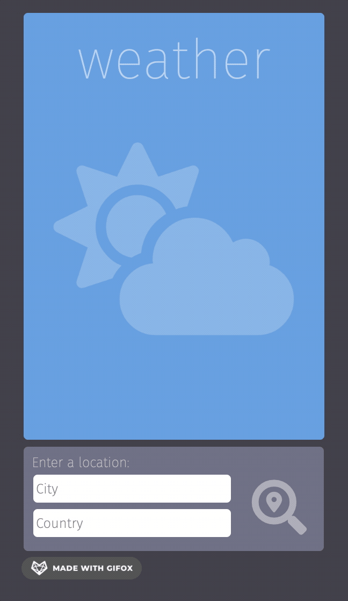
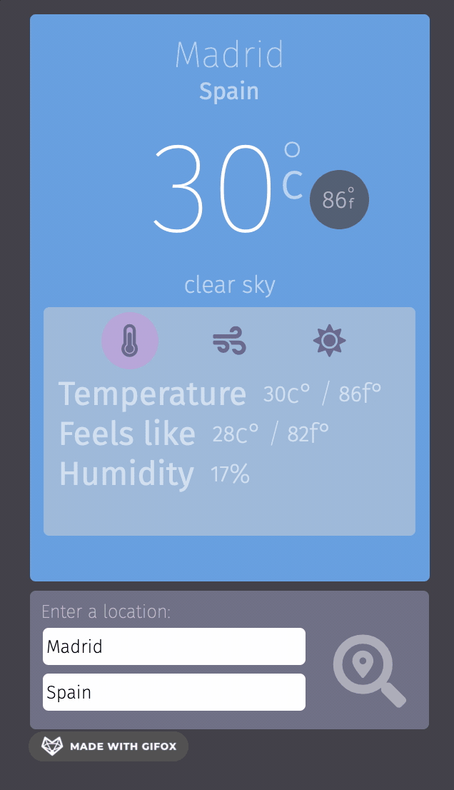

# Weather App
The goal for this project was to implement asynchronous JavaScript via async/await functions to create a weather forecast site using a free weather API. The user can enter a city and country and the current weather in that location will be fetched and displayed on the screen. I created a custom country filter input that allows the user to easily find the desired country by typing in the first letters. In addition to displaying temperature in both Celsius and Fahrenheit, it shows information for humidity, wind speed and direction, current local time, and sunrise and sunset times converted to local time.

## Description

